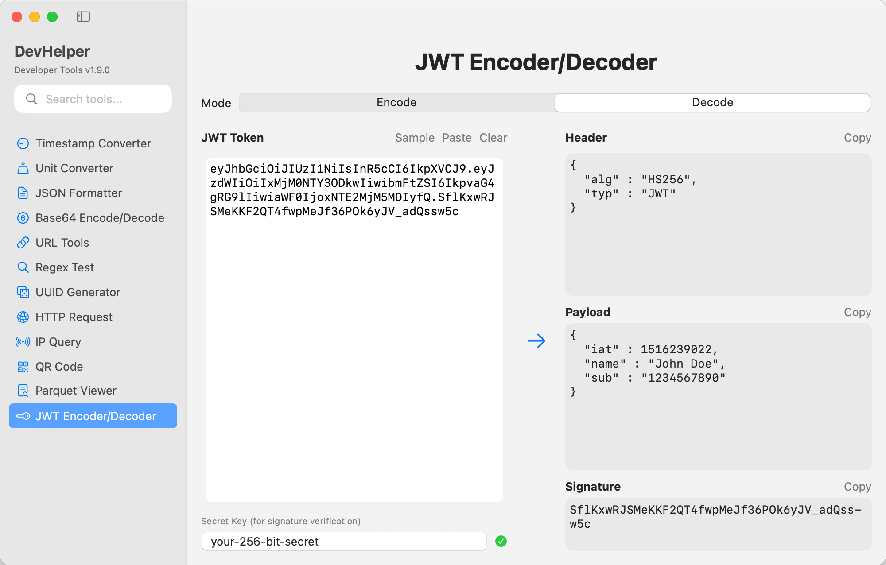

# DevHelper

A native macOS application for developers, containing 14 essential tools commonly used in software development.

> This tool was 100% developed by `Claude Code`.

## Features

- **Timestamp Converter** - Convert between timestamps and human-readable dates with multiple format support
- **Unit Converter** - Convert between different units (Data, Time, Length, Weight, Temperature, Area, Volume)
- **JSON Formatter** - Format, validate, and compare JSON data with diff view
- **SQL Formatter** - Format and minify SQL queries with syntax validation
- **HTML Formatter** - Format and minify HTML with proper tag indentation
- **Base64 Encode/Decode** - Encode and decode Base64 strings
- **JWT Encoder/Decoder** - Encode and decode JSON Web Tokens with HMAC signature support
- **Regex Test** - Test regular expressions with pattern matching
- **UUID Generator** - Generate UUIDs in various formats including v7 with timestamp extraction
- **URL Tools** - URL encoding/decoding and parsing
- **HTTP Request** - Full-featured HTTP client with method selection, headers, auth, response handling, and JSON tree view
- **IP Query** - Discover your IP address and query geolocation data for any IP
- **QR Code** - Generate QR codes with multiple sizes and error correction levels, scan QR codes from images
- **Parquet Viewer** - Read and explore Parquet / arrow files with schema inspection and data export
- **JWT encoder/decoder** - Encode and decode JSON web token

## Key Features

- **Search Functionality** - Quickly find tools using the search bar in the sidebar
- **Selectable Results** - Copy results directly from the output areas
- **Modern UI** - Clean, intuitive interface designed for macOS
- **Real-time Conversion** - Instant results as you type

## Requirements

- macOS 14.0 or later
- Xcode 15.4 or later (for development)

## Installation

1. Clone this repository
2. Open `DevHelper.xcodeproj` in Xcode
3. Build and run the project

## Version

Current version: 1.10.0

## Screenshots

#### Timestamp Converter

#### Unit Converter

#### Json Formater

#### Base64 Encode/Decode

#### URL Tools

#### Regex Test

#### UUID Generator

#### Http Request

Http Request History

#### IP Query

#### QR Code

#### Parquet Viewer

Parquet data view

#### JWT Encoder/Decoder

